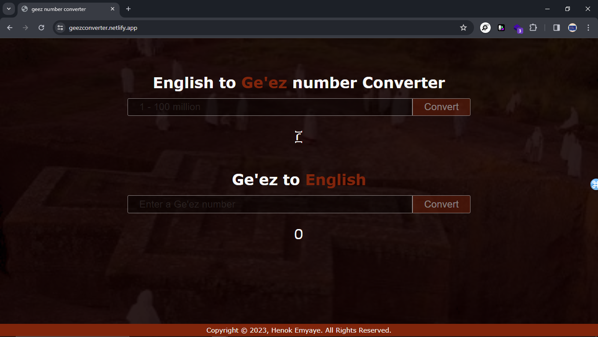

# Ge'ez Number converter using javaScript
---

### Preview
#### [Live Preview](https://geezconverter.netlify.app/)

This project is **Ge'ez Number converter** using HTML, CSS, and JavaScript, Ge'ez numbers are traditionally used in **Ethiopia** and **Eritrea**.

## Features

- It converts 1-100m English numbers to **Ge'ez**.
- It converts 1-1000 **Ge'ez** numbers to English (reverse).
- Simple and intuitive user interface.

### How to Use?

- Simply open the `index.html` file in a web browser.
- To convert specific number, put approprait number and press Enter or "convert" button

## Technologies Used

- HTML
- CSS
- **JavaScript**

## Contributing

Contributions are welcome! Please feel free to submit any bug fixes or enhancements as pull requests.

## Contact

For any questions or inquiries, feel free to contact the project maintainer at [telegram](https://t.me/henaorth).
